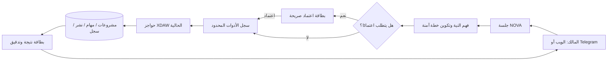

# خارطة تحسين XDAW NOVA المستلهمة من CyberNova

**التاريخ:** 16 أغسطس 2026  
**الإعداد:** Manus AI  
**الحالة:** جاهزة للاعتماد؛ لا يتضمن هذا المستند تنفيذًا تشغيليًا أو تغييرًا في القنوات أو سياسة النشر.

## القرار المختصر

تملك CyberNova نموذجًا جيدًا لتجربة وكيل منظم، لكنه ليس مشروعًا يُنقل كما هو. القيمة التي تستحق الاحتفاظ بها هي **الجلسة المستمرة، التخطيط قبل الفعل، بطاقات الأدوات، الذاكرة، وصفات العمل، وسجل التنفيذ**. أما أدوات الاستطلاع والهجوم والفحص الأمني، ونموذج سطح المكتب الوهمي، ومسارات API الخاصة بها، فلا تخدم منصة إنتاج محتوى مسؤولة ويجب أن تبقى خارج XDAW NOVA نهائيًا.

> الهدف هو بناء **NOVA Assistant**: مساعد واحد داخل غرفة التحكم وTelegram، يفهم الطلب العربي أو الإنجليزي، يحوّله إلى خطة واضحة، ينفذ فقط الأدوات المسموحة، يبين ما فعله، ويحترم بوابات الحقوق والسلامة وسياسة النشر القائمة.

## نطاق المراجعة وطريقتها

جرى فهرسة أرشيف `Hello-Peace.rar` نصيًا، وفصل مكوناته المرجعية إلى واجهة `cybernova`، وخادم `api-server`، ونموذج `mockup-sandbox`. لم يُشغّل أي ملف من الأرشيف، ولم تُثبت تبعياته، ولم تُنسخ أسراره أو تُستورد أي مساراته إلى XDAW NOVA. استندت المراجعة إلى الطبقات المرجعية التالية: `LiveAgentPanel.tsx`، `NovaAgentChat.tsx`، `TaskManager.tsx`، `BotHealthBar.tsx`، ومسارات الجلسات والذاكرة والمعرفة والـPlaybooks والوظائف والتدقيق والإشعارات وWebhooks.

أُجريت المطابقة أيضًا مع البنية الموجودة في XDAW NOVA: لوحة التحكم ومساحة العمل الموحدة، `AIChatBox`، `LaunchConsole`، جداول المشاريع والمواد والمهام والنشر والتنبيهات، ومراقبي القنوات والجدولة الخلفية. لذلك تعيد الخارطة استخدام ما هو موجود بدل إنشاء طبقات مكررة.

## الخلاصة البنيوية

| طبقة CyberNova المرجعية | القيمة الحقيقية | حالتها في XDAW NOVA | قرار الدمج |
|---|---|---|---|
| اللوحة الحية والمحادثة | جلسات، رسالة، خطة، نتائج أدوات | توجد واجهة محادثة أولية فقط، بلا حفظ أو أوامر محكومة | **إعادة بناء كاملة** بهوية NOVA |
| الجلسات والرسائل | استمرارية السياق والتدقيق | لا يوجد نموذج دائم للجلسات | **يضاف** كطبقة بيانات مستقلة |
| بطاقات الأدوات | شرح ما نُفذ وما نتج عنه | إجراءات البداية موجودة ومتفرقة | **يضاف** فوق أدوات XDAW المعتمدة |
| Playbooks | وصفة قابلة للتكرار وسجل تشغيل | توجد جدولة ومهام، لا توجد وصفات محتوى | **يضاف** لروتين المحتوى |
| الذاكرة | تفضيلات وقرارات قابلة للاسترجاع | لا توجد ذاكرة مساعد منضبطة | **يضاف** مع تصنيف وصلاحية |
| قاعدة المعرفة | بحث في وثائق وملفات | توجد مصادر ومكتبة مواد | **يؤجل** ويعاد توجيهه للحقوق والهوية والمحتوى |
| مدير المهام | عرض عمليات جارية وموقوفة | `workflow_tasks` وHeartbeat موجودان | **يُعاد تشكيله** كـ«مركز تشغيل المحتوى» |
| شريط صحة المحركات | كشف تعثر مزود أو قناة | توجد مراقبة YouTube وInstagram وتنبيهات Telegram | **يُحسّن** ليعرض حقائق التشغيل فقط |
| Webhooks | استقبال أوامر/أحداث | Telegram متصل للتنبيهات فقط | **يُضاف بحذر** لاستقبال أوامر المالك |
| أدوات الأمن والطرفية | لا علاقة لها بإنتاج المحتوى | خارج مجال المنتج | **مستبعدة نهائيًا** |

## ما يملك XDAW NOVA بالفعل

لا يبدأ المشروع من الصفر. لدى XDAW NOVA دورة محتوى واضحة: مصادر، أصول مرخّصة، مشاريع فيديو ثنائية اللغة، مهام سير عمل، بوابة مراجعة، جداول نشر، تشغيلات نشر، وقنوات مفوضة. كما أن `workflow_tasks` يعبّر أصلًا عن مهمة محتوى فعلية، و`publishing_runs` يمثل تاريخ النشر، و`system_change_log` و`notification_events` يسجلان جوانب من الأثر التشغيلي. ينبغي أن يستند المساعد إليها بدل إنشاء «مدير نظام» منفصل أو عرض موارد حاسوب محاكاة.

| الأصل القائم | الاستخدام في NOVA Assistant |
|---|---|
| `AIChatBox` | نواة عرض الرسائل؛ توسّع لتدعم معرّفات الرسائل، بطاقات الخطة والأداة، ومحدد الجلسة |
| `DashboardLayout` و`Workspace` | إضافة دخول ثابت باسم **NOVA Assistant** ومركز تشغيل مساعد، لا نافذة سطح مكتب عائمة |
| `LaunchConsole` | المصدر الأول للأدوات الآمنة: إنشاء مشروع، اقتراح مصدر، وتسجيل أصل مرخّص |
| `workflow_tasks` | الحقيقة التشغيلية لعمليات السكربت، الحقوق، السلامة، الإنتاج، والنشر |
| `publishing_policies` و`publishing_runs` | حكم النشر؛ لا يملك المساعد طريقًا يتجاوزها |
| `content_assets` وتخزين S3 | مرفقات مع بيانات ترخيص؛ تحفظ البايتات في التخزين لا في قاعدة البيانات |
| مراقبو القنوات وTelegram | صحة القنوات والتنبيهات؛ توسع لاحقًا إلى إدخال أوامر المالك الموثقة |

## تصميم NOVA Assistant المقترح

### تجربة المستخدم

تظهر صفحة **NOVA Assistant** في القائمة الرئيسية، مع إمكانية فتح لوحة مضغوطة من غرفة التحكم لاحقًا. في الجهة اليمنى قائمة الجلسات، وفي الوسط المحادثة، وفي الجهة المقابلة شريط «الخطة والتنفيذ». لا يظهر تفكير داخلي خام أو سلسلة استدلال؛ يظهر فقط **ملخص عملي** في أربع حالات مفهومة: «فهم الطلب»، «الخطة المقترحة»، «ينفذ الآن»، و«النتيجة والسجل».

كل أمر له رقم تتبع. عند اقتراح فعل مؤثر، يعرض المساعد بطاقة تذكر النطاق، القنوات أو المشاريع المتأثرة، القيود التي ستتحقق، وما إذا كان يحتاج اعتمادًا. بعد التنفيذ، تتحول إلى بطاقة نتيجة توضح النجاح أو الإيقاف أو الفشل والرابط إلى السجل المرتبط.

| نوع الطلب | أمثلة | سياسة التنفيذ |
|---|---|---|
| قراءة فقط | حالة القنوات، ما هو مجدول، نتائج آخر فيديو | ينفذ مباشرة ويعرض مصدر الحقيقة |
| إنشاء مسودة | مشروع، فكرة، مصدر مقترح، وصف نشر، مسودة جدول | ينفذ مباشرة ضمن حساب المالك ويسجل الأثر |
| فعل منظم | تشغيل Playbook، طلب مراجعة، تجهيز حزمة نشر | يعرض خطة مختصرة ثم ينفذ وفق مستوى الخطر |
| فعل عالي الأثر | تغيير سياسة النشر، تعطيل/تفعيل مفتاح الإيقاف، إنشاء أو تعديل تفويض، حذف سجل/أصل، نشر خارج مسار معتمد | لا ينفذ إلا باعتماد صريح داخل الجلسة |
| نشر مجدول معتمد مسبقًا | حزمة اجتازت الحواجز والسياسة والجداول المفوضة | يستمر خلفيًا دون تأكيد لكل منشور، وفق `guarded_auto` والحواجز الحالية |

### بنية التنفيذ الخادمي

لا يستدعي نموذج المحادثة أي قناة أو قاعدة بيانات أو خدمة خارجية مباشرة. يمر كل أمر عبر **سجل أدوات محدود** على الخادم، ويملك كل تعريف أداة: مخطط إدخال مضبوط، نوع الأثر، دالة تفويض، شروط الحواجز، ومعرّف تدقيق. يدعو المساعد إجراءات الخدمة الموجودة أو إجراءات جديدة موجهة للمحتوى؛ ولا ينشئ مسارات CyberNova المرجعية أو يقلدها.

### نموذج البيانات المقترح

ينفذ ذلك بترحيل واحد متسق بعد الاعتماد. لا تحفظ الرسائل أو المرفقات أسرار OAuth أو رموز القنوات أو بيانات اعتماد. المرفق يربط بمفتاح تخزين S3 وببياناته الوصفية فقط.

| الجدول المقترح | الغرض والحقول الأساسية | صلته بالنماذج القائمة |
|---|---|---|
| `assistant_sessions` | `ownerId`، العنوان، المصدر `web/telegram`، الحالة، آخر نشاط | سياق دائم لكل محادثة |
| `assistant_messages` | `sessionId`، الدور، المحتوى، نوع العرض، الزمن | الرسالة تظل منفصلة عن سجل النظام |
| `assistant_action_plans` | `sessionId`، ملخص الخطة، مستوى الأثر، الحالة، وقت الاعتماد | يوثق «خطط أولًا» بلا بث تفكير خام |
| `assistant_action_steps` | الخطة، الترتيب، اسم الأداة، الإدخال المنقح، الحالة، النتيجة المنقحة | بطاقات التنفيذ داخل الواجهة |
| `assistant_attachments` | الجلسة، `assetId` أو مفتاح S3، الاسم، MIME، الحجم | يعيد استخدام `content_assets` والتخزين |
| `assistant_memories` | المالك، النوع `preference/project/rule/decision`، العنوان، المحتوى، الحالة، مصدر الإنشاء | ذاكرة قابلة للمراجعة والحذف |
| `content_playbooks` | المالك، العنوان، الوصف، مستوى الأثر، الحالة | وصفات أعمال XDAW المتكررة |
| `content_playbook_steps` | الـPlaybook، الترتيب، اسم الأداة، إدخال مضبوط | لا يسمح إلا بأدوات سجل XDAW |
| `playbook_runs` | الـPlaybook، الجلسة، الحالة، ملخص النتيجة، وقت البدء/الانتهاء | يدعم سجل تشغيل قابلًا للتدقيق |
| `assistant_audit_events` | رقم تتبع، الممثل، الفعل، الكيان، القرار، النتيجة، تفصيل آمن | يكمل ولا يستبدل `system_change_log` و`publishing_runs` |

## Playbooks ذات الأولوية

لا تكون الـPlaybooks «أوامر حرة»؛ بل وصفات مملوكة للمالك، ذات خطوات وأدوات محددة. ينشئ NOVA Assistant نسخًا أو يقترح تعديلها، لكن لا يوسع صلاحياتها تلقائيًا.

| Playbook | خطواته العالية المستوى | الأثر المتوقع |
|---|---|---|
| **تجهيز حزمة مراجعة** | فحص اكتمال السكربت والأصول والرخص، إنشاء مهام الحقوق/السلامة، تلخيص النواقص | تجهيز مشروع للمراجعة؛ لا نشر |
| **تهيئة توزيع محكوم** | فحص الإقرار والحواجز والسياسة والقنوات، إنشاء مسودات القنوات والجدول | يطلب اعتمادًا عند إنشاء أو تعديل الجدول |
| **فحص نبض القنوات** | قراءة الحالة المخزنة، تحديد الانقطاعات، إعداد موجز Telegram | قراءة فقط؛ لا تجديد تفويض أو نشر من Playbook نفسه |
| **دورة تعلم من الأداء** | قراءة التحليلات المتاحة، مقارنة النسخ AR/EN، اقتراح موضوع أو تحسين | اقتراح فقط؛ لا تعديل تلقائي للهوية أو السياسة |
| **بناء Reel ثنائي اللغة** | إنشاء مشروعين/حزمة، تسجيل موجز، فتح مهام إنتاج ومراجعة | يبدأ في مرحلة المسودات فقط |

## Telegram: من تنبيه إلى قناة أوامر مقيدة

يضاف استقبال Telegram في مرحلة منفصلة عن إرسال التنبيهات الحالي. يستقبل الخادم Webhook موثقًا بمفتاح سري، ويتحقق من `update_id` لمنع التكرار، ويسمح فقط بـ`chat_id` المالك المسجل. ينشئ كل طلب جلسة مرتبطة بـTelegram أو يستأنف جلسة محفوظة، ثم يطبق سجل الأدوات نفسه المستخدم في الويب؛ لا توجد صلاحيات مختلفة أو «باب خلفي» في Telegram.

تظل الرسائل النصية قناة غير مناسبة للأسرار: لا كلمات مرور أو رموز وصول أو رموز تحقق أو معلومات OAuth في المحادثة، ولا تعرض الردود أي قيمة حساسة. للأوامر المؤثرة يرسل المساعد ملخص الخطة وزر/صيغة اعتماد موثقة، أو يوجه المالك إلى واجهة الويب إذا تطلب الأمر معاينة أصل أو مراجعة تفصيلية.

## مركز تشغيل المحتوى

يستلهم مركز التشغيل من نمط `TaskManager`، لكنه يستخدم بيانات XDAW الحقيقية فقط. يبين التبويبات التالية: «قيد التنفيذ»، «بانتظار مراجعة»، «مجدول»، «موقوف/فاشل»، و«آخر عمليات المساعد». لا يعرض استخدام CPU/RAM أو نوافذ نظام أو خدمات محاكاة. تنفذ الأزرار المسموحة فقط: فتح السجل، إيقاف جدولة يتوافق مع سياسة المالك، وإعادة محاولة عملية مصرح بها عندما يجيز منفذها ذلك.

## ما يستبعد نهائيًا

| فئة مستبعدة | سبب الاستبعاد |
|---|---|
| CVE وExploit-DB والفحص الشبكي وNmap وأدوات الاختبار الهجومي | خارج هدف المنتج وتوسّع الصلاحيات بلا حاجة للمحتوى |
| الطرفية وتنفيذ أوامر النظام | لا يلزم لإدارة محتوى القنوات ويزيد المخاطر |
| مزود Ollama المحلي | ليس جزءًا من البنية المدارة ولا حاجة إليه في هذا المسار |
| نسخ مسارات API أو DTOs أو أسرار CyberNova | فصل ملكية وبيئة المنتجين وغياب ضمان التوافق |
| بث التفكير الخام | يخلط تفاصيل داخلية غير مستقرة مع تجربة المستخدم؛ يستخدم بدلًا منه ملخص الخطة |
| واجهات بيانات محاكاة | XDAW يعرض مهام وقنوات وعمليات نشر فعلية من قاعدة البيانات |
| TikTok | يبقى مستبعدًا من جميع أدوات المساعد والـPlaybooks والجدولة حتى الموافقة الرسمية الصريحة |

## ترتيب التنفيذ المقترح

### الأولوية الأولى: أساس المساعد المحكوم

تنشأ جلسات ورسائل وخطط وخطوات أدوات وسجل تدقيق، ثم تضاف صفحة NOVA Assistant باستخدام `AIChatBox` بعد تحسينه بدل استبداله. تبدأ الأدوات بالقراءة وإنشاء المسودات فقط: حالة القنوات، ملخص الجداول، إنشاء مشروع، اقتراح مصدر، وتسجيل أصل. في نهاية هذه المرحلة يستطيع المالك محادثة مساعد يحفظ السياق ويعرض خطة وأثرًا واضحين، من دون منح أي صلاحية نشر جديدة.

### الأولوية الثانية: الذاكرة وPlaybooks المحتوى

تضاف ذاكرة مراجعة قابلة للتحكم، ثم أول Playbooks للمراجعة والتوزيع والتعلم من الأداء. تظل الوصفة التي تمس الجداول أو القنوات خاضعة لمستوى الأثر المحدد، وتدون كل تشغيل في سجل مستقل. هذه المرحلة تحول الإجراءات المتكررة إلى عمليات متسقة ومراجعة بدل أوامر نصية غامضة.

### الأولوية الثالثة: Telegram ومركز التشغيل

يضاف Webhook Telegram الموثق لاستقبال أوامر المالك، مع تطابق كامل بين ضوابطه وضوابط الويب. ثم يعرض مركز تشغيل المحتوى الحالة الحقيقية لمهام الإنتاج والمراجعة وHeartbeat والنشر وعمليات المساعد. لا يلزم تشغيل متصفح ولا تتغير الجدولة الخلفية القائمة.

### الأولوية الرابعة: المرفقات والبحث المعرفي والصوت

تربط الجلسات بالأصول والتقارير المخزنة، ثم يضاف بحث معرفي محدود في وثائق هوية XDAW، الرخص، السياسات، وسجلات النتائج. واجهة الصوت اختيارية وتأتي بعد اكتمال كتابة النصوص والاختبارات، وليست شرطًا للتشغيل المستقل.

## معايير القبول والاختبارات

| المجال | معيار القبول |
|---|---|
| الجلسات | يستطيع المالك إنشاء جلسة واستئنافها، ولا يرى مستخدم آخر بياناتها |
| الأوامر | لا يستدعى سوى تعريف أداة مسجل ومتحقق من مخطط الإدخال والتفويض |
| الاعتماد | لا ينفذ فعل عالي الأثر بلا خطة واعتماد صالحين ومقترنين بمعرّف الجلسة |
| النشر | تظل جميع الحواجز الحالية والسياسة وCanary والسقف ومفتاح الإيقاف هي الحكم النهائي |
| السجل | لكل خطوة أداة رقم تتبع وحالة ونتيجة منقحة؛ لا تسجل رموز أو أسرار |
| Telegram | يرفض أي Chat غير مسموح أو تحديث مكرر أو توقيع غير صالح، ولا ينفذ أمرًا خارج سجل الأدوات |
| الجودة | تضاف اختبارات Vitest للبيانات، التفويض، الأدوات، الاعتماد، Webhook، وPlaybooks؛ ثم يمر فحص النوع والانحدار الكامل |
| الاستمرارية | تظل مراقبة القنوات والجدولة الخلفية تعملان عبر Heartbeat من دون متصفح أو جلسة واجهة |

## أثر التنفيذ المتوقع

بعد الأولوية الأولى سيكون لدى XDAW NOVA مساعد موحد حقيقي بدل عناصر واجهة متناثرة: يسأل المالك «ما الذي يحتاج مراجعة؟»، أو «جهز مسودة Reel»، أو «اعرض حالة القنوات»، فيفهم النظام المجال ويعطي خطة قابلة للمراجعة ونتيجة قابلة للتدقيق. بعد الأولويتين الثانية والثالثة تصبح الأوامر المتكررة والوصول من Telegram منظمين ومحددين، مع احتفاظ النشر المعتمد بقدرته على الاستمرار خلفيًا تحت قواعده الحالية.

## قرار الاعتماد المطلوب

القرار المطلوب هو اعتماد خارطة التنفيذ **بالترتيب**: نبدأ بالأولوية الأولى فقط، نتحقق منها باختبارات وواجهة حقيقية، ثم نعرض نتيجة مستقلة قبل إضافة الذاكرة والـPlaybooks، وبعدها Telegram. لا يغير هذا الاعتماد سياسة النشر، ولا يصل TikTok، ولا يرفع أو ينشر محتوى جديدًا بمفرده.

## مراجع داخلية

1. `/home/ubuntu/daousha/docs/cybernova-live-agent-review-2026-08-16.md` — مراجعة الفهرسة والحدود الآمنة.
2. `/home/ubuntu/cybernova_review/artifacts/cybernova/src/components/desktop/LiveAgentPanel.tsx` — مرجع تجربة الجلسة والأداة.
3. `/home/ubuntu/cybernova_review/artifacts/cybernova/src/components/desktop/TaskManager.tsx` — مرجع نمط متابعة التنفيذ، لا بياناته المحاكاة.
4. `/home/ubuntu/cybernova_review/artifacts/api-server/src/routes/live_agent.ts` و`playbooks.ts` و`memory.ts` و`knowledge.ts` — مراجع أنماط البيانات فقط.
5. `/home/ubuntu/daousha/drizzle/schema.ts` و`client/src/pages/Workspace.tsx` و`client/src/components/AIChatBox.tsx` — البنية الحالية التي ستُوسَّع.
